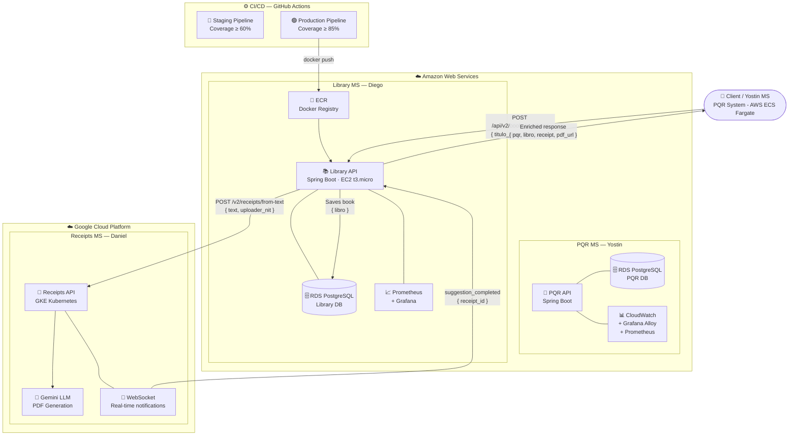

## 🏗️ Multicloud Architecture



### Flow Description
1. **Yostin's MS** detects 5 PQRs for the same book → calls `POST /api/v2/books/purchase`
2. **Library API** saves the book in RDS → calls Daniel's MS
3. **Daniel's MS** generates accounting PDF with Gemini LLM → notifies via WebSocket
4. **Library API** returns enriched response with all 3 entities

### Final Response
```json
{
  "pqr":     { "id": "uuid", "asunto": "Clean Code", "responsable": "...", "conteo": 5 },
  "libro":   { "id": 1, "title": "Clean Code", "author": "Robert Martin", "isbn": "..." },
  "receipt": { "id": "uuid", "empresa": "Biblioteca Central", "valor": 85000, "pdf_url": "..." },
  "pdf_url": "http://34.60.178.4/v2/receipts/{id}/pdf"
}
```
