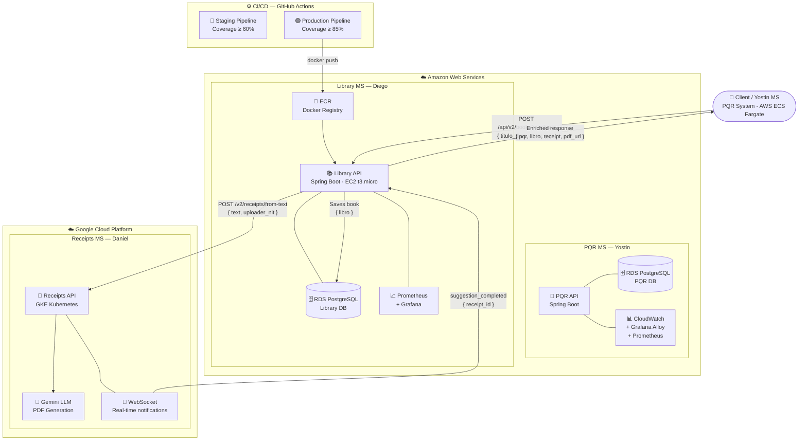
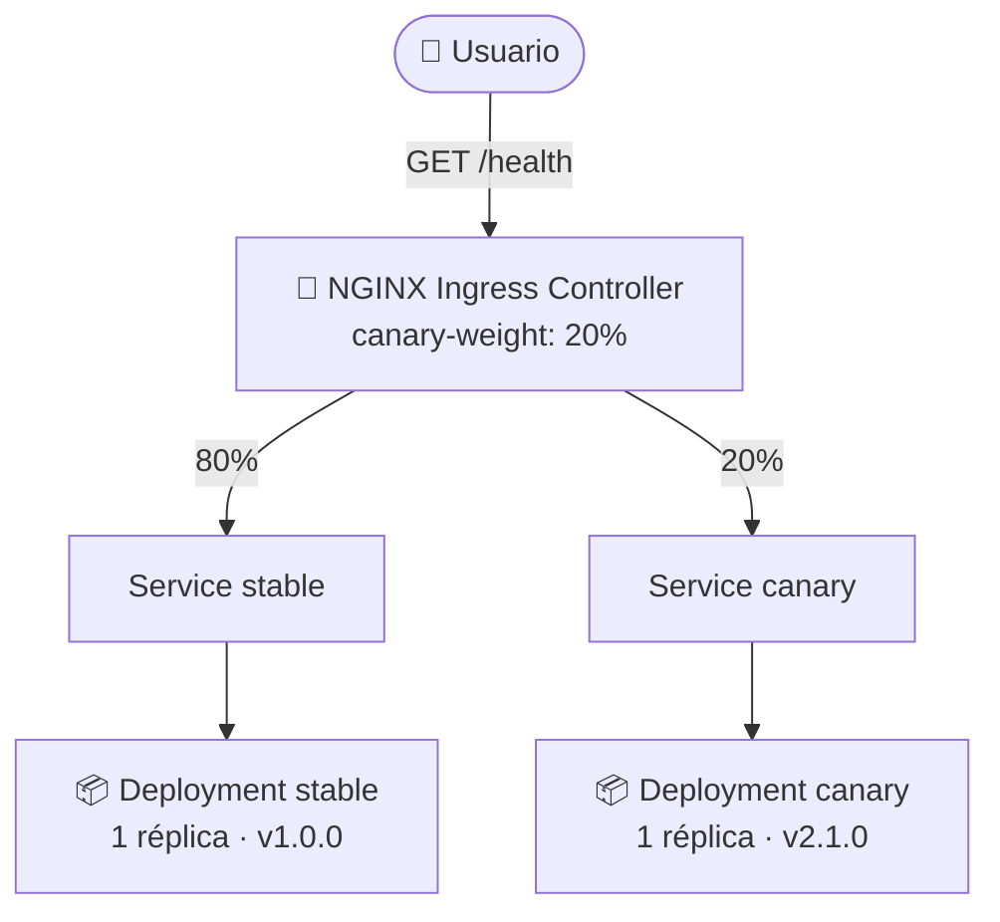

## 🏗️ Multicloud Architecture

```mermaid
flowchart TD
    Client(["👤 Client / Yostin MS\nPQR System - AWS ECS Fargate"])
    subgraph AWS ["☁️ Amazon Web Services"]
        subgraph YostinMS ["PQR MS — Yostin"]
            PQR["🔔 PQR API\nSpring Boot"]
            PQRDB[("🗄️ RDS PostgreSQL\nPQR DB")]
            CW["📊 CloudWatch\n+ Grafana Alloy\n+ Prometheus"]
            PQR --- PQRDB
            PQR --- CW
        end
        subgraph DiegoMS ["Library MS — Diego"]
            LIB["📚 Library API\nSpring Boot · EC2 t3.micro"]
            LIBDB[("🗄️ RDS PostgreSQL\nLibrary DB")]
            ECR["🐳 ECR\nDocker Registry"]
            MON["📈 Prometheus\n+ Grafana"]
            LIB --- LIBDB
            LIB --- MON
            ECR --> LIB
        end
    end
    subgraph GCP ["☁️ Google Cloud Platform"]
        subgraph DanielMS ["Receipts MS — Daniel"]
            REC["🧾 Receipts API\nGKE Kubernetes"]
            GEMINI["🤖 Gemini LLM\nPDF Generation"]
            WS["🔌 WebSocket\nReal-time notifications"]
            REC --> GEMINI
            REC --- WS
        end
    end
    subgraph CICD ["⚙️ CI/CD — GitHub Actions"]
        PIPE1["🔵 Staging Pipeline\nCoverage ≥ 60%"]
        PIPE2["🟢 Production Pipeline\nCoverage ≥ 85%"]
    end
    Client -->|"POST /api/v2/books/purchase\n{ titulo_libro, autor, pqr }"| LIB
    LIB -->|"Saves book\n{ libro }"| LIBDB
    LIB -->|"POST /v2/receipts/from-text\n{ text, uploader_nit }"| REC
    WS -->|"suggestion_completed\n{ receipt_id }"| LIB
    PIPE2 -->|"docker push"| ECR
    LIB -->|"Enriched response\n{ pqr, libro, receipt, pdf_url }"| Client
```
### Flow Description
1. **Yostin's MS** detects 5 PQRs for the same book → calls `POST /api/v2/books/purchase`
2. **Library API** saves the book in RDS → calls Daniel's MS
3. **Daniel's MS** generates accounting PDF with Gemini LLM → notifies via WebSocket
4. **Library API** returns enriched response with all 3 entities
### Final Response
```json
{
  "pqr":     { "id": "uuid", "asunto": "Clean Code", "responsable": "...", "conteo": 5 },
  "libro":   { "id": 1, "title": "Clean Code", "author": "Robert Martin", "isbn": "..." },
  "receipt": { "id": "uuid", "empresa": "Biblioteca Central", "valor": 85000, "pdf_url": "..." },
  "pdf_url": "http://34.60.178.4/v2/receipts/{id}/pdf"
}
```

## 🐤 Canary Deployment (Seguimiento 4)

### Estrategia de redirección

Se implementa un **Canary Deployment** en Kubernetes (GKE) usando **NGINX Ingress Controller** para dividir el tráfico entre dos versiones de la Library API:

- **Stable (v1.0.0)** → recibe el **80%** del tráfico, responde `"status": "stable"`
- **Canary (v2.1.0)** → recibe el **20%** del tráfico, responde `"status": "canary"` con la feature visible `new-book-recommendations`

La división de tráfico se controla mediante anotaciones de NGINX Ingress:

```yaml
nginx.ingress.kubernetes.io/canary: "true"
nginx.ingress.kubernetes.io/canary-weight: "20"
```

### Arquitectura del Canary


```mermaid
flowchart TD
    User(["👤 Usuario"])
    Ingress["🔀 NGINX Ingress Controller\ncanary-weight: 20%"]
    SvcStable["Service stable"]
    SvcCanary["Service canary"]
    DepStable["📦 Deployment stable\n1 réplica · v1.0.0"]
    DepCanary["📦 Deployment canary\n1 réplica · v2.1.0"]

    User -->|"GET /health"| Ingress
    Ingress -->|"80%"| SvcStable
    Ingress -->|"20%"| SvcCanary
    SvcStable --> DepStable
    SvcCanary --> DepCanary
```

### Componentes Kubernetes

| Archivo | Descripción |
|---|---|
| `k8s/deployment-stable.yaml` | Deployment de la versión estable (v1.0.0) |
| `k8s/deployment-canary.yaml` | Deployment de la versión canary (v2.1.0) |
| `k8s/service.yaml` | Dos services: uno para stable y otro para canary |
| `k8s/ingress.yaml` | Ingress NGINX con división de tráfico 80/20 |

### URLs para validar (Postman)

**Endpoint con división de tráfico (Ingress NGINX):**
```
GET http://34.67.80.26/health
```

**Respuesta stable (80%):**
```json
{
  "status": "stable",
  "version": "1.0.0",
  "service": "library-api"
}
```

**Respuesta canary (20%):**
```json
{
  "status": "canary",
  "version": "2.1.0",
  "service": "library-api",
  "features": "new-book-recommendations"
}
```

### Monitoreo de la estrategia de redirección

Para visualizar la distribución de tráfico entre stable y canary:

```bash
for i in $(seq 1 10); do curl -s http://34.67.80.26/health | grep -o '"status":"[a-z]*"'; done
```

Esto muestra la proporción de respuestas, evidenciando el reparto aproximado 80/20.

### Comandos de despliegue

```bash
# Crear secret con credenciales de BD
kubectl create secret generic library-secrets \
  --from-literal=db-url="<jdbc-url>" \
  --from-literal=db-user="<user>" \
  --from-literal=db-password="<password>"

# Instalar NGINX Ingress Controller
kubectl apply -f https://raw.githubusercontent.com/kubernetes/ingress-nginx/controller-v1.11.3/deploy/static/provider/cloud/deploy.yaml

# Desplegar la aplicación
kubectl apply -f k8s/deployment-stable.yaml
kubectl apply -f k8s/deployment-canary.yaml
kubectl apply -f k8s/service.yaml
kubectl apply -f k8s/ingress.yaml
```
